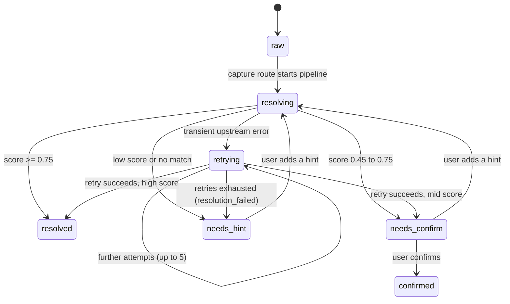

# Architecture — Engine First, Shells as Experiments

## Governing decision (2026-07-16)

The **engine** — ingestion, resolution, provenance, storage — is the product and the
asset. **Shells** (bot, native app, web) are cheap, swappable experiments that speak to
the engine through two narrow contracts. This resolves the bot-vs-app debate by
reordering it: build the shared 80% first, decide the shell at a gate with better
information (PLAN.md step 2.4).

Rejected alternatives, for the record:
- *Native-app-first* — commits the biggest build cost before the engine's magic is
  proven; rejected as premature, not as wrong.
- *Bot-first as the product* — couples the product to one platform's ToS; rejected as
  identity, retained as a candidate shell.

## System shape

```
  Shells (thin, swappable)
  ┌───────────┐ ┌───────────┐ ┌───────────┐
  │ Web       │ │ Bot       │ │ Native    │   ← only Web receipt is built in Stage 1;
  │ (receipt +│ │ (WhatsApp/│ │ app +     │     bot/app compete at the Stage-2 gate
  │ quick-add)│ │ Telegram) │ │ share ext │
  └─────┬─────┘ └─────┬─────┘ └─────┬─────┘
        └─────────────┼─────────────┘
             Contract 1: Ingestion API
             Contract 2: Receipt API
        ┌─────────────┴─────────────┐
        │           ENGINE          │
        │  ingest → resolve → store │
        │  (async pipeline)         │
        └─────────────┬─────────────┘
        TMDB API · tesseract.js OCR · Intelligent Fallback (pluggable LLM, T4) · Postgres + object storage
```

## Contract 1 — Ingestion API

`POST /api/captures` — accepts a raw capture, returns immediately (trust contract
Law 2). No resolution happens on this request.

```jsonc
{
  "payload_type": "url | text | image",
  "payload": "<url or text>",          // or multipart image upload
  "source": "instagram | whatsapp | web | manual | unknown",  // auto where possible
  "captured_at": "ISO-8601",
  "who_hint": "priya"                   // optional, user-supplied only (Law 4)
}
```

**Images** are sent as `multipart/form-data` (field `image`) rather than JSON. Bytes go
to a **private** Supabase Storage bucket (`captures`, auto-created on first use); the
row keeps only `payload_image_ref` (the object path). Screenshots can hold personal
content, so nothing is ever a public URL: the receipt reads them back through a
same-origin proxy, `GET /api/captures/:id/image`, which streams the bytes via the
service role. Captures are immutable, so that response is cacheable indefinitely.

## Contract 2 — Receipt API

`GET /api/items` — chronological list, each item in exactly one state:

- `raw` — stored, not yet processed (visible: "caught, working on it")
- `resolving` — the pipeline is actively running (server-written truth, not a UI guess)
- `retrying` — a transient upstream failure (e.g. TMDB) is being retried
- `resolved` — auto-matched at high confidence; raw original linked and inspectable
- `needs_confirm` — top candidate attached, awaiting one tap
- `needs_hint` — low confidence, OR retries exhausted (`metadata.resolution_failed`);
  asks for one word
- `confirmed` — user-verified

`resolving`/`retrying` are written by the resolution handler so the receipt reflects
backend progress instead of inferring it from elapsed time. A run that exhausts its
retries lands explicitly in `needs_hint` — never left stuck. `POST /api/items/:id/confirm`
and `POST /api/items/:id/hint` complete the loop.

## Resolution state machine

The state of an item is backend truth: every transition is a database write by a named
server component, and the receipt only ever renders the state it reads. This section
documents the machine exactly as implemented — no planned or aspirational states.



`resolved` and `confirmed` are terminal — no code transitions out of them (the immutable
capture underneath is never touched regardless).

### What each state means

- **`raw`** — the capture is stored; the item row exists but resolution has not started.
  The receipt shows "Caught. Starting to identify…".
- **`resolving`** — the extraction waterfall + resolver are actively running.
- **`retrying`** — a transient upstream failure (typically a TMDB `ECONNRESET`/`4xx`) is
  being retried with backoff, up to 5 attempts.
- **`resolved`** — auto-matched at high confidence (score ≥ 0.75); the matched entity is
  attached and the original capture stays linked.
- **`needs_confirm`** — a top candidate exists but confidence is middling (0.45–0.75) or
  a close runner-up made it ambiguous; awaits one tap (Law 3: never silently guess).
- **`needs_hint`** — no confident candidate (score < 0.45 or no match), OR the run
  exhausted its retries. The latter carries `metadata.resolution_failed = true`, which
  the UI surfaces as distinct copy ("couldn't reach the identification service").
- **`confirmed`** — the user has verified a candidate.

### Which component owns each transition

| Transition | Owner | Trigger |
| --- | --- | --- |
| `[*] → raw` | capture route (`app/api/captures`) | item row inserted after the capture is stored |
| `raw → resolving` | capture route, or hint route (`app/api/items/[id]/hint`) | `markItemState` before invoking the pipeline |
| `resolving → retrying`, `retrying → retrying` | resolver (`lib/resolve/resolver.ts`) | `onRetry` callback fired before each backoff attempt |
| `resolving`/`retrying` → `resolved` \| `needs_confirm` \| `needs_hint` | scorer (`lib/resolve/score.ts`) decides; `applyResolutionToItem` (`lib/items.ts`) writes | pipeline run completes; state chosen by score thresholds |
| `resolving`/`retrying` → `needs_hint` (`resolution_failed`) | capture/hint route catch → `markResolutionFailed` | pipeline throws (retries exhausted / missing key) |
| `needs_confirm → confirmed` | confirm route (`app/api/items/[id]/confirm`) | user taps confirm (guarded `.eq("state","needs_confirm")`) |
| `needs_confirm → resolving`, `needs_hint → resolving` | hint route | user submits a one-word hint; item re-enters the pipeline |

The pipeline (`lib/resolve/pipeline.ts`) orchestrates extraction and forwards `onRetry`;
it computes the outcome but does not itself write item state — the routes do, so the
persisted state and the HTTP response never disagree.

### Invariants

1. **The frontend renders backend truth.** The receipt derives every state label from
   the `state` column; it holds no timers and makes no elapsed-time guesses. Polling
   continues only while an item is `raw`/`resolving`/`retrying`.
2. **The original capture is never lost (Law 1).** `captures` rows are immutable at the
   database level (trigger blocks UPDATE/DELETE); item state is interpretation layered
   on top and never overwrites the evidence.
3. **Unknown states are rejected by the database.** `items.state` carries a CHECK
   constraint listing exactly these seven values; any other value fails with a 23514
   violation, so a typo or drift can't persist a phantom state.
4. **No item is ever stuck.** A resolution run that fails terminates in `needs_hint`
   (with `resolution_failed`), never left in `resolving`/`retrying`.
5. **Never silently guess (Law 3).** Middling or ambiguous confidence resolves to
   `needs_confirm`, not `resolved`; low confidence resolves to `needs_hint`.

## Data model

Two tables, deliberately separated — the raw capture is immutable evidence, the item is
interpretation (this separation IS trust-contract Law 1):

**captures** — id, payload_type, payload_text / payload_image_ref, source, who_hint,
captured_at. Never updated, never deleted.

**items** — id, capture_id (FK), state, tmdb_id, title, year, media_type (movie|tv),
poster_ref, confidence, who, resolved_at, confirmed_at.

Vertical extensibility (designed, not built): `items.entity_type` defaults to
`screen_title`; vertical-specific fields live in a `metadata jsonb` column. Adding
books later means a new resolver and a new entity_type — no schema migration of the core.

## Resolution pipeline (async, triggered per capture)

Four pure-function stages plus a loop, all modules in `lib/resolve/` — **module
boundaries, not infrastructure**. No queues, no services, no per-stage deployables
(decided 2026-07-16: budget + MVP simplicity). The Receipt is deliberately NOT a
pipeline stage — it is Contract 2, a reader of item states.

1. **Normalizer — deterministic only, no AI (hard rule).** Unwrap short links, strip
   trackers, canonicalize URLs, store images, normalize metadata. Testable with plain
   fixtures, no mocks.
2. **Extractor — a tiered waterfall; each tier runs only if the previous produced no
   confident candidate.** Output: candidates `{title, year?, media_type?, language?}`,
   each tagged with the tier that produced it.
   - **T0 — URL patterns:** IMDb/TMDB/Letterboxd/JustWatch/YouTube IDs parsed from
     paths → direct-lookup candidates (near-certain, zero cost).
   - **T1 — Page metadata:** OG title / oEmbed fetch for other URLs.
   - **T2 — Text parse:** strip service words ("netflix", "prime"), split who-hints
     ("— from priya"); the remainder is a title candidate for fuzzy search.
   - **T3 — OCR (images):** tesseract.js (WASM, runs inside the same serverless
     function) → text → T2.
   - **T4 — Intelligent Fallback:** a capability, not a vendor. Any capable LLM behind
     one narrow interface (`fallbackExtract(capture) → candidates`); the specific
     provider (Gemini, Claude, Ollama-hosted open models, …) is an env-level
     implementation decision. MVP preference: free-tier or locally hosted where
     practical. Invoked ONLY when T0–T3 fail; every invocation logged and counted.
3. **Entity Resolver — pluggable interface, exactly one implementation.**
   `EntityResolver.search(candidate) → scored matches`. Today: TMDB. The interface is
   the extensibility; a registry, resolver config, or second implementation is
   **rejected until a second vertical exists** (YAGNI). Cross-vertical routing ("is
   this a movie or a restaurant?") is itself a classification problem V1 gets to skip
   entirely — the pipeline assumes `screen_title`.
4. **Confidence Scorer** — combines the extraction tier (T0 ≈ certain, T3 shaky), the
   extractor's self-rating, and the resolver's match quality → `resolved` /
   `needs_confirm` / `needs_hint` (trust contract Law 3). Thresholds tuned at PLAN.md
   steps 1.3 / 2.2 against real inputs.
5. **Hint loop** — a user hint re-enters the Extractor at T2 with the hint appended.

**Budget principle (added 2026-07-16).** Buildable on a student/indie budget: every
component free/open-source where reasonably possible, paid AI demoted to the logged
last tier. Enforcement is **ordering + measurement, not prohibition** — the metric
"% of captures resolved with zero LLM calls" is first-class (PLAN.md 4.1); target: a
clear majority LLM-free. Honest note: at dogfooding volume the T4 fallback costs
pennies/month; the waterfall's real value is determinism, latency, testability, and a
cost dial that exists before scale does. Zero-AI absolutism was considered and
rejected — if OCR alone fails Stage 2's magic bar but LLM-fallback passes it, that is
a working product with a trivial bill, not a budget failure (see PLAN.md R1).

Regional note: test sets must include Hindi and regional-language titles from the start
(PLAN.md R6) — TMDB coverage there is the pipeline's most likely blind spot.

## Stack (decided 2026-07-16)

- **Next.js (TypeScript) on Vercel** — one deployable holds the API routes, the async
  resolution handlers, and the web receipt shell; types shared end-to-end with any
  future web/app shell.
- **Supabase** — Postgres + object storage (screenshot payloads) + row-level auth
  later; fastest managed path, no ops.
- **TMDB API** — movie/TV entities (free tier is sufficient for dogfooding).
- **tesseract.js** — free WASM OCR for screenshot text (T3); single-stack, runs inside
  the same serverless function, no extra service.
- **Intelligent Fallback (T4)** — a pluggable LLM behind one narrow interface; the
  provider is chosen by env config, not by the architecture. MVP preference: free-tier
  or locally hosted models where practical; any capable provider works. The versioned
  prompt + test set in the repo is what makes swapping providers safe — **portability
  is guaranteed by rerunning the test set, not by the abstraction** — so a provider
  swap is: change the env var, rerun `test/resolution-set.json`, compare scores.

Total MVP run cost: ≈ $0/month (all free tiers) plus T4 usage (≈ $0 on free-tier or
local providers; pennies on paid ones at dogfooding volume).

Rejected: separate Python service for the pipeline (splits the stack for no benefit at
this scale — this also rules out Python-only OCR like PaddleOCR for now); no-code tools
(can't express the resolution pipeline or the trust contract); per-stage
queues/services (plumbing before product); resolver plugin registry (interface yes,
framework no — see pipeline stage 3); multi-provider LLM adapter framework (same rule —
one interface plus env config is the whole abstraction).

## What the engine deliberately does not know

Which shell called it, which LLM vendor powers T4, streaming availability, social
graphs, other users (single-tenant until Stage 5). Every one of these is a coupling we
refuse until a stage demands it.
